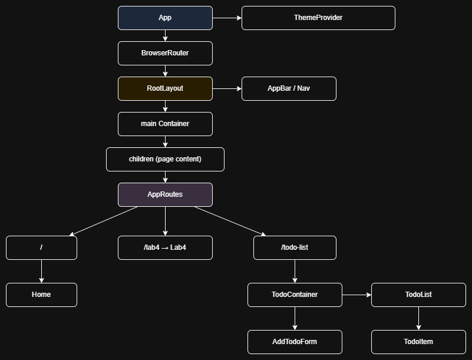

(Simple portfolio shell built from the original Todo app)

Getting started

- Install deps: `npm install`
- Run dev server: `npm run dev`

Or 
`https://react-lab4-mu.vercel.app/`

Pages

- `/` — Home / Portfolio landing
- `/todo-list` — Todo app
- `/lab4` — Lab 4

---

## Component (UI) tree

## Архітектурні рішення

- **UI:** React (функціональні компоненти + хуки).
- **Маршрутизація:** React Router DOM (`Routes`, `Route`, `Navigate`).
- **Стан додатку:** Zustand для глобального стану тудушок (fetch, add, delete, toggle, edit).
- **Логіка:** поєднання кастомного hook'а `useTodos` та `useTodoStore` для відокремлення бізнес-логіки від презентаційних компонентів.
- **Data fetching:** прямі запити до `https://dummyjson.com/todos` з простими пагінацією та оптимістичними оновленнями (toggle).
- **Оптимізації:** використано `React.memo`, `useMemo`, `useCallback` для мінімізації повторних рендерів.

## Вибір компонентної бібліотеки

- Використано **Material UI (MUI)**: 
  - Швидка розмітка та готові доступні компоненти (AppBar, Button, List, Paper тощо).
  - Вбудована підтримка тем (light/dark) через `createTheme` та `ThemeProvider`.

## Додаткові відомості

- Технічний стек: **React**, **Vite**, **Zustand**, **React Router**, **Material UI**.
- API: використовується `https://dummyjson.com` як тестове API для задач.
- Файлова структура основних файлів: `src/components`, `src/hooks`, `src/stores`, `src/theme`, `src/routes`, `src/layouts`.

